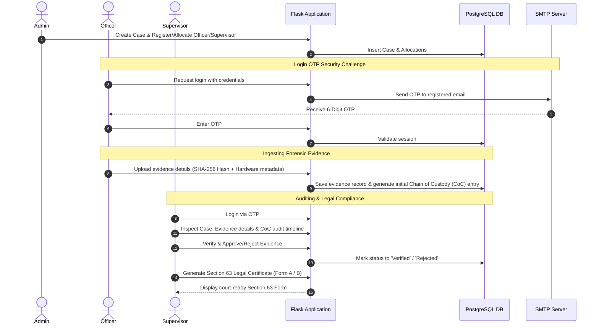

# Evidence Management System (EMS)

A secure, web-based digital evidence tracking and management application built in Python/Flask and backed by PostgreSQL. Designed for law enforcement, forensics labs, and judicial review systems, EPS ensures cryptographic integrity, a tamper-proof audit trail, and compliance with electronic evidence regulations.

---

## 📋 Table of Contents
1. [System Architecture & Lifecycle](#-system-architecture--lifecycle)
2. [Role-Based Workflows (Step-by-Step Guide)](#-role-based-workflows-step-by-step-guide)
3. [Technology Stack](#-technology-stack)
4. [Database Architecture & Schema Details](#-database-architecture--schema-details)
5. [Setup & Configurations](#-setup--configurations)
    - [PostgreSQL Database Setup](#1-postgresql-database-setup)
    - [Two-Factor Authentication (OTP SMTP)](#2-two-factor-authentication-otp-smtp)
    - [Razorpay Integration (Salary Sandbox)](#3-razorpay-integration-salary-sandbox)
6. [Installation & Execution Guide](#-installation--execution-guide)
7. [API & Routing Reference](#-api--routing-reference)
8. [Troubleshooting FAQ](#-troubleshooting-faq)

---

## 🔄 System Architecture & Lifecycle

The lifecycle of electronic evidence within EPS is strictly monitored and recorded. The sequence diagram below shows the flow from registration to legal certification:



---

## 👥 Role-Based Workflows (Step-by-Step Guide)

To help testing or deploying the application, here is how each user role interacts with the system:

### 👤 1. System Administrator
1. **Login**: Go to the login panel and use credentials `ADMIN001` and password `Admin@123` (Admin bypasses email OTP).
2. **Personnel Setup**:
   * Go to **Add Officer** and **Add Supervisor** under the Admin menu.
   * Auto-generated IDs (e.g., `officer-1`, `supervisor-1`) are calculated based on registered records. Provide their names, passwords, and valid email addresses.
3. **Case Creation**:
   * Navigate to **Create Case**. Fill in the title, description, and police station.
   * Assign an allocated Officer and Supervisor to this case using the dropdown lists.
4. **Manage Chain of Custody (CoC)**:
   * When evidence moves between officers, admins can record custody transfers from **Chain of Custody** by choosing the case, the evidence ID, current holder, receiver, and reason.
5. **Salary Payout**:
   * Open **Active Officers**. You can toggle status to Inactive/Active or change passwords.
   * Enter a salary amount and click **Pay Salary**. This fires up the Razorpay payment modal where you can simulate a payment.

### 👮 2. Investigation Officer
1. **Secure Login**:
   * Provide the assigned ID (e.g., `officer-1`), password, select **Officer** role, and submit.
   * The app generates a 6-digit OTP and emails it to the officer. Submit this code to enter the dashboard.
2. **Dashboard & Cases**:
   * The dashboard lists only the cases assigned to this officer.
3. **Ingest Digital Evidence**:
   * Navigate to **Upload Evidence**. Select the assigned case ID.
   * Provide precise details: File Name, File Path, Nature of Evidence (e.g., WhatsApp chat export, CCTV footage, DVR hard disk), Device Type, Brand, Serial Number, OS, and the **cryptographic SHA-256 hash value** of the file.
   * Saving this automatically inserts the evidence with a `Pending` status and registers the first Chain of Custody entry.

### 🔍 3. Case Supervisor
1. **Secure Login**:
   * Log in (e.g., `supervisor-1`) with password and verify credentials via the email OTP.
2. **Evidence Auditing**:
   * Navigate to **Verify Evidence**. Filter by Case ID.
   * View the ingested evidence list. Select an item to view metadata, check the cryptographic hash, and check the timeline of custody transfers.
3. **Verification**:
   * Approve or reject the evidence, adding review notes for the trial logs.
4. **Section 63 Certificate Generation**:
   * Under Indian Evidence Act / Bharatiya Sakshya Adhiniyam (BSA), electronic evidence is admissible only with a certificate.
   * Navigate to **Section 63 Form**. Enter the Evidence ID. If the evidence is `Verified`, you can choose between **Form A** or **Form B** to auto-fill and render a certificate ready to be printed or saved.

---

## 🛠️ Technology Stack

* **Backend core**: Python 3.x, Flask (session-based authentication, routing, templating)
* **Database**: PostgreSQL (relational integrity, check constraints, cascade deletes)
* **Email Broker**: SMTP over TLS (`smtplib`, `email.mime`)
* **Payment Broker**: Razorpay Client Library
* **User Interface**: HTML5 templates, Vanilla CSS, JS/AJAX (Razorpay checkout handlers, dropdown updates)

---

## 🗄️ Database Architecture & Schema Details

Refer to [schema.sql](file:///c:/Users/Preyash/Downloads/EMSystem/EMSystem/schema.sql) for details. Below is the relational structure of the database:

### 1. `users`
Stores all account types (Admin, Officers, Supervisors).
* `user_id` (Unique ID, e.g., `ADMIN001`, `officer-1`)
* `password_hash` (Stored using SHA-256 for secure storage)
* `is_active` (Deactivated personnel are locked out of the app)

### 2. `cases`
Records case details.
* `case_id` (Formatted tracking code, e.g., `CASE-2026-001`)
* `status` (Restricted via CHECK constraints: `Active`, `Closed`, `Pending`, `Archived`)

### 3. `case_allocations`
Establishes a junction table between users and cases. Restricts access so officers and supervisors can only view their allocated cases.

### 4. `evidence`
Primary digital forensics registry table. Holds file metadata, device serial numbers, and cryptographic checksums:
* `hash_value` (The file's checksum to prevent tampering/modification)
* `status` (Starts at `Pending`, moves to `Verified` or `Rejected` through supervisor auditing)

### 5. `chain_of_custody`
Auditing timeline table. Keeps a history of every transfer (from officer, to officer, date/time, and purpose/justification).

### 6. `salary_payments`
Stores Razorpay transactions.
* `razorpay_order_id`, `razorpay_payment_id`, `razorpay_signature` (Verifies payment authenticity)
* `status` (Payments are updated: `created` -> `paid` or `failed`)

---

## ⚙️ Setup & Configurations

### 1. PostgreSQL Database Setup
Ensure PostgreSQL is running locally or remotely, then create the database:
```sql
CREATE DATABASE evidence_db;
```
Import the schema:
```bash
psql -U postgres -d evidence_db -f schema.sql
```
*This command creates the tables and sets up the default user `ADMIN001` with the hashed version of `Admin@123`.*

### 2. Two-Factor Authentication (OTP SMTP)
The OTP relies on a standard Gmail SMTP broker. The configuration is located at [app.py:L31-L35](file:///c:/Users/Preyash/Downloads/EMSystem/EMSystem/app.py#L31-L35):
```python
SMTP_SERVER = "smtp.gmail.com"
SMTP_PORT = 587
SMTP_EMAIL = ""
SMTP_APP_PASSWORD = ""  # App-specific password
```
> [!TIP]
> If you wish to use your own email account, generate a **Gmail App Password** (under Google Account settings -> Security -> 2-Step Verification -> App Passwords) and update `SMTP_EMAIL` and `SMTP_APP_PASSWORD`.

### 3. Razorpay Integration (Salary Sandbox)
The payment portal uses default test credentials located at [app.py:L18-L19](file:///c:/Users/Preyash/Downloads/EMSystem/EMSystem/app.py#L18-L19):
```python
RAZORPAY_KEY_ID = 'rzp_test_SSbOdDCw5ffIUk'
RAZORPAY_KEY_SECRET = 'l3GCUC0BDSHgU91Jg8tgY7Hz'
```
*To test payouts, the Admin clicks 'Pay Salary'. This launches the Razorpay Checkout form. You can complete mock payments in sandbox mode using test card numbers.*

---

## 🚀 Installation & Execution Guide

Follow these steps to set up and run the application locally:

### Step 1: Pre-requisites
Make sure you have Python 3.8+ and PostgreSQL installed.

### Step 2: Install Required Libraries
Install the requirements from [requirements.txt](file:///c:/Users/Preyash/Downloads/EMSystem/EMSystem/requirements.txt):
```bash
pip install -r requirements.txt
```

### Step 3: Run the Application
Start the Flask local development server:
```bash
python app.py
```
By default, the server runs on: **`http://127.0.0.1:5000/`**

---

## 📍 API & Routing Reference

Here is a summary of the routes defined in [app.py](file:///c:/Users/Preyash/Downloads/EMSystem/EMSystem/app.py) for easy reference:

| Route Path | Method(s) | Description | Role Required |
| :--- | :--- | :--- | :--- |
| `/` | `GET` | Landing page, displays role-based login panel | Any / Unauth |
| `/login` | `POST` | Process credentials. Redirects to OTP verification for non-admins | Unauth |
| `/verify_otp` | `GET`, `POST` | 2FA OTP code validation form | Pending User |
| `/resend_otp` | `POST` | Generate and send a new login OTP | Pending User |
| `/logout` | `GET` | Clear session variables and redirect to landing page | Authenticated |
| `/admin/dashboard` | `GET`, `POST` | View active cases and update case statuses | Admin |
| `/admin/add_officer` | `GET`, `POST` | Register a new officer account (auto-increments ID) | Admin |
| `/admin/add_supervisor` | `GET`, `POST` | Register a new supervisor account (auto-increments ID) | Admin |
| `/admin/create_case` | `GET`, `POST` | Open a new case and assign handling personnel | Admin |
| `/admin/chain_of_custody` | `GET`, `POST` | Log manual transfers and view evidence timelines | Admin |
| `/admin/active_officer` | `GET`, `POST` | Toggle officer statuses (active/inactive) | Admin |
| `/admin/pay_salary` | `POST` | Call Razorpay API to generate a salary payment order | Admin |
| `/admin/verify_salary_payment` | `POST` | Verify the cryptographic Razorpay payload signature | Admin |
| `/admin/salary_history/<id>`| `GET` | View payment history log | Admin |
| `/officer/dashboard` | `GET` | View active assigned cases | Officer |
| `/officer/upload_evidence`| `GET`, `POST` | Upload digital evidence metadata and logs CoC | Officer |
| `/officer/verify_status` | `GET`, `POST` | Search status of submitted evidence | Officer |
| `/supervisor/dashboard` | `GET` | View assigned cases | Supervisor |
| `/supervisor/verify_evidence`| `GET`, `POST` | Review evidence and update status (Approve/Reject) | Supervisor |
| `/supervisor/section_63` | `GET`, `POST` | Generate legal Form A/B certificates | Supervisor |
| `/change_password` | `GET`, `POST` | Update personal login passwords | Admin |

---

## ❓ Troubleshooting FAQ

### 1. Database connection errors
* Check that PostgreSQL service is running on your machine.
* Update `DB_USER` and `DB_PASS` in [app.py](file:///c:/Users/Preyash/Downloads/EMSystem/EMSystem/app.py) to match your PostgreSQL account setup.

### 2. Login OTP email is not arriving
* Ensure you are connected to the internet.
* Check your spam folder.
* Verify that the SMTP port `587` is not blocked by your firewall.
* If using the default Gmail credentials, Google may occasionally throttle requests due to shared volume. You can configure your own sender email in [app.py](file:///c:/Users/Preyash/Downloads/EMSystem/EMSystem/app.py).

### 3. Razorpay payment failure
* Ensure `RAZORPAY_KEY_ID` and `RAZORPAY_KEY_SECRET` in [app.py](file:///c:/Users/Preyash/Downloads/EMSystem/EMSystem/app.py) are valid API keys.
* If using custom keys, verify they are **Test Mode** keys. Live keys will fail if currency settings or capture preferences do not match your account profile.
* Use Razorpay's mock payment details (e.g., standard OTP `123456` or sandbox banking options) during payment simulation.
